# SWS Programmer — Telink TLSR825x programmer on ESP32-S3 (N8R2)

Universal **ESP32-S3** programmer and debugging tool. Its main job is programming
Telink **TLSR825x** chips (for example the Tuya **TS0201** temperature/humidity
sensor) over the single-wire **SWS** interface — no extra hardware is needed, the
ESP32-S3 bit-bangs SWS directly from a GPIO. It also bundles a multi-protocol
toolbox: SPI NOR flash, microSD card, UART, RS485, 1-Wire, I²C, GPIO control and
wireless flashing of other ESP chips — all with a built-in web UI.

> **This repository ships the `N8R2` build:** `ESP32-S3-DevKitC-1-N8R2`
> with **8 MB (Quad SPI)** flash and **2 MB (Quad SPI)** PSRAM.
> There is a separate repository for the other memory variant.

---

## English

### Features

- **SWS / Telink TLSR825x programmer** — bit-banged single-wire programming
  (identify, read, erase, write, verify) of the target flash through the target's
  MSPI registers. Only 4 wires to the target: VCC, GND, SWS, RST.
- **SPI NOR flash programmer** — read/write 25xx chips in-circuit through a SOIC-8
  clip (2 MHz, safe for long clip leads).
- **microSD card** — SPI access, browse + upload/download + **format** from the web UI.
- **UART target** (115200 8N1) and **RS485** (half-duplex, MAX485/SN75176).
- **1-Wire** (DS18B20 etc.) and **I²C** bus scan / register read.
- **GPIO control** panel for the remaining free pins.
- **ESP bridge** — flash other ESP8266/ESP32/ESP32-C3 chips wirelessly over TCP
  (`esptool.py --port socket://<ip>:3232`) with automatic bootloader entry.
- **Web UI** — SoftAP `SWS-Programmer` / password `12345678`, open
  `http://192.168.4.1` in a browser. Optional STA mode (set in `include/config.h`).

### Pinout

| Function        | ESP32-S3 pin | Notes                                   |
|-----------------|--------------|-----------------------------------------|
| SWS (data)      | GPIO42       | through 470 Ω to target SWS             |
| RST (reset)     | GPIO41       | through 470 Ω to target RST             |
| UART target TX  | GPIO17       | ESP32 → target RX                       |
| UART target RX  | GPIO18       | ESP32 ← target TX                       |
| RS485 TX / RX / DE | 33 / 34 / 35 | through MAX485/SN75176 transceiver      |
| SD SCK/MISO/MOSI/CS | 14/15/16/21 | HSPI, Catalex microSD module            |
| SPI flash SCK/MISO/MOSI/CS | 12/13/11/10 | FSPI, SOIC-8 clip, 2 MHz      |
| I²C SDA / SCL   | 8 / 9        | 4.7 kΩ pull-ups                         |
| 1-Wire          | GPIO4        | 4.7 kΩ pull-up to 3V3                   |
| ESP bridge IO0 / EN | 5 / 6     | GPIO0 / EN of the target ESP            |
| Console         | GPIO43 / 44  | UART0, 115200 8N1 (CH343 → USB)         |

### Flashing the prebuilt firmware

Prebuilt image: `firmware/sws_programmer_esp32s3_n8r2_v1.1.bin`.

**Via PlatformIO** (recommended — flashes bootloader + partition table + app):

```powershell
pio run -e esp32s3 -t upload --upload-port COMx
```

**Via esptool** (app image only, to a board that already has the Arduino partition table):

```powershell
esptool.py --chip esp32s3 --port COMx --baud 921600 write_flash -z 0x10000 firmware\sws_programmer_esp32s3_n8r2_v1.1.bin
```

### Build from source

```powershell
pio run -e esp32s3
```

The firmware is built with [PlatformIO](https://platformio.org/) and the
ESP32 Arduino core (`platform = espressif32 @ ^6.7.0`).

### Web UI quick start

1. Flash the firmware and power the board.
2. Join the Wi-Fi network **`SWS-Programmer`** (password `12345678`).
3. Open `http://192.168.4.1` in a browser.

You can reach the same UI via **mDNS** at `http://swsprog.local`, or — after
joining your home Wi-Fi in the *WiFi* tab — at the board's DHCP address
(e.g. `http://192.168.1.195`). OTA updates use the same mDNS address
(`http://swsprog.local`, password `swsprog`).

#### Every tab explained

The UI is a single-page app with 12 tabs and an always-visible console
(log + command line) at the bottom.

| # | Tab | Function |
|---|-----|----------|
| 1 | 📌 **Piny** | Pin legend — every function (SWS, RST, UART, RS485, SPI flash, SD, 1-Wire, I²C, ESP bridge) with its exact GPIO and notes. |
| 2 | 🔌 **TLSR825x** | Main job: single-wire **SWS** programming of Telink TLSR825x. Detect chip (`CHIP` / `CHIPID`), `SWSTEST` link test, memory `STAT`, analog-register read/write/dump (ADC calibration), upload firmware, `Verify`, and `Flash` (erase + write + reset). |
| 3 | 💾 **SPI Flash** | SOIC-8 25xx flash programmer. Detect chip (JEDEC), blank check, read to `.bin`, erase sectors / full chip, verify and write. |
| 4 | 📟 **UART** | Serial terminal (115200 8N1 default) on the target UART pins: start/stop, auto-baud, RX→SD logging, send text or HEX. |
| 5 | 🔁 **RS485** | Half-duplex terminal through a MAX485/SN75176 transceiver: start/stop, send text or HEX. |
| 6 | 🌡️ **1-Wire** | Bus scan and temperature read for DS18B20 / DS18S20 / DS1822 / iButton. |
| 7 | 🔗 **I²C** | Bus scan (1..126), register read, plus 24xx EEPROM (24C01..24C512) read/write with 8- or 16-bit addressing. |
| 8 | ⚡ **GPIO** | Control panel for the free pins (input / pull-up / pull-down / output, toggle) and a PWM generator (pin, frequency, duty). |
| 9 | 📡 **ESP (esptool)** | Flash other ESP8266 / ESP32 / ESP32-C3 wirelessly: bootloader entry, reset, and a TCP bridge on port 3232 (`esptool.py --port socket://<ip>:3232`). |
| 10 | 💳 **Karta SD** | microSD browser: file list, upload/download, delete, **format**, SD diagnostics. |
| 11 | 🩺 **Diagnostyka** | One-click diagnostics: `PINS`, `CHIP`, `SWSTEST`, `STAT`, `JEDEC`, `SPI`, `PROBE`, `VSCAN`, `VMEAS`, `WAVE` — results go to the console. |
| 12 | 📶 **WiFi** | Scan networks, join your home Wi-Fi (STA), clear saved credentials, show AP/STA status. |

The console at the bottom accepts every command keyword directly
(e.g. `SPI`, `SPIREAD 0 100`, `JEDEC`, `CHIP`, `STAT`, `SDLS`) and shows all
output in real time.

#### Screenshots

| Piny | TLSR825x | SPI Flash |
|------|----------|-----------|
| 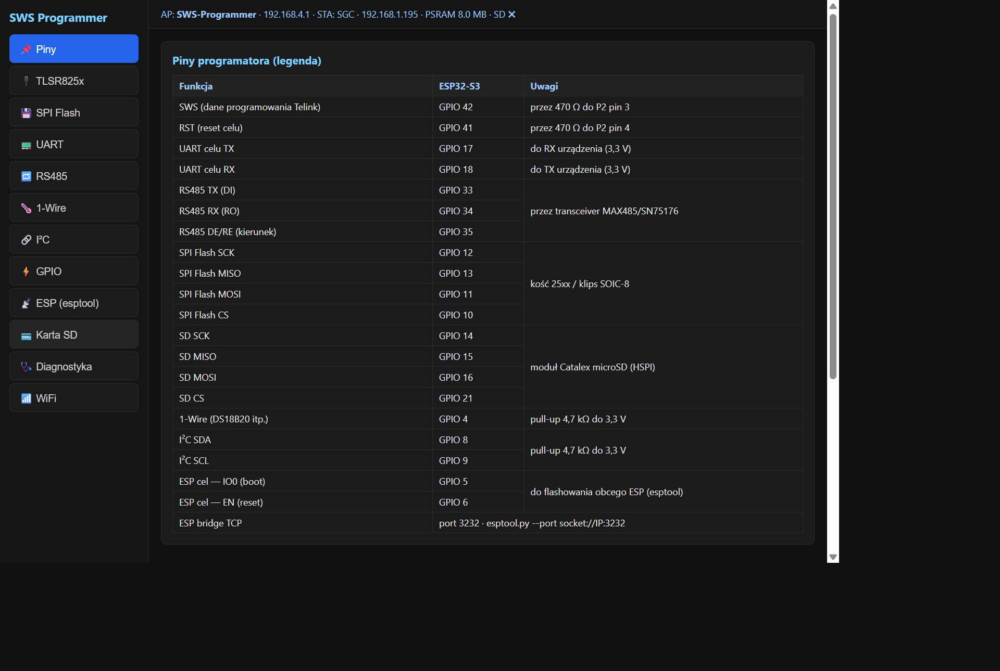 | 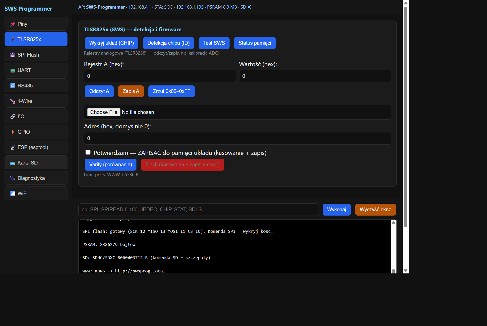 | 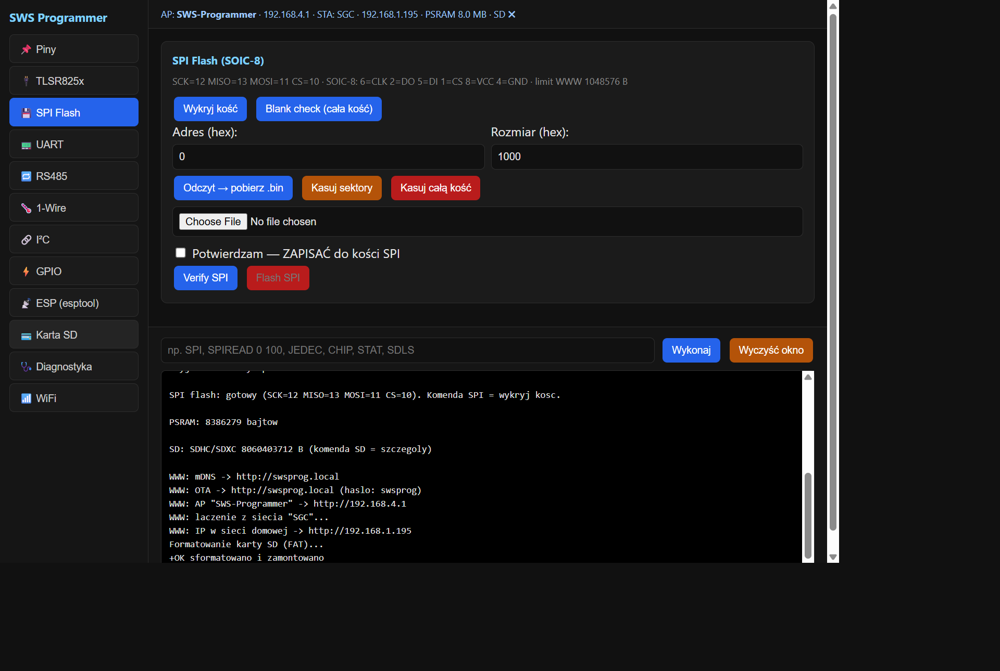 |

| UART | RS485 | 1-Wire |
|------|-------|--------|
| 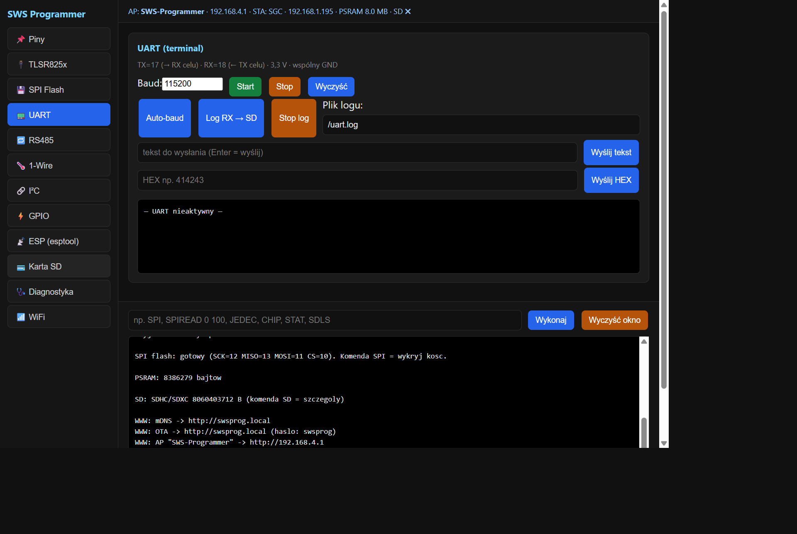 | 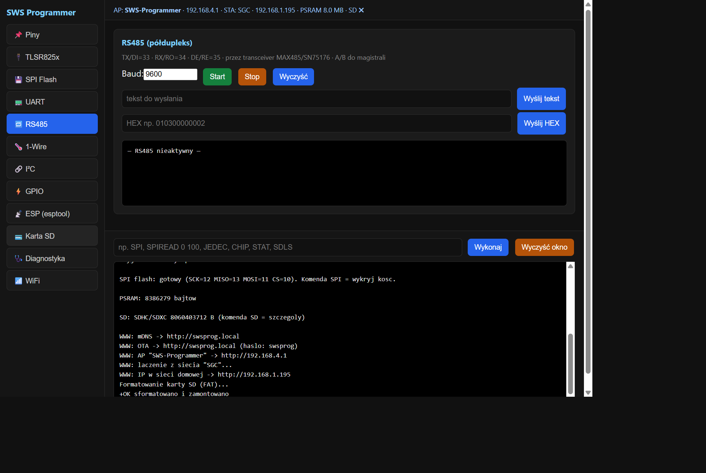 | 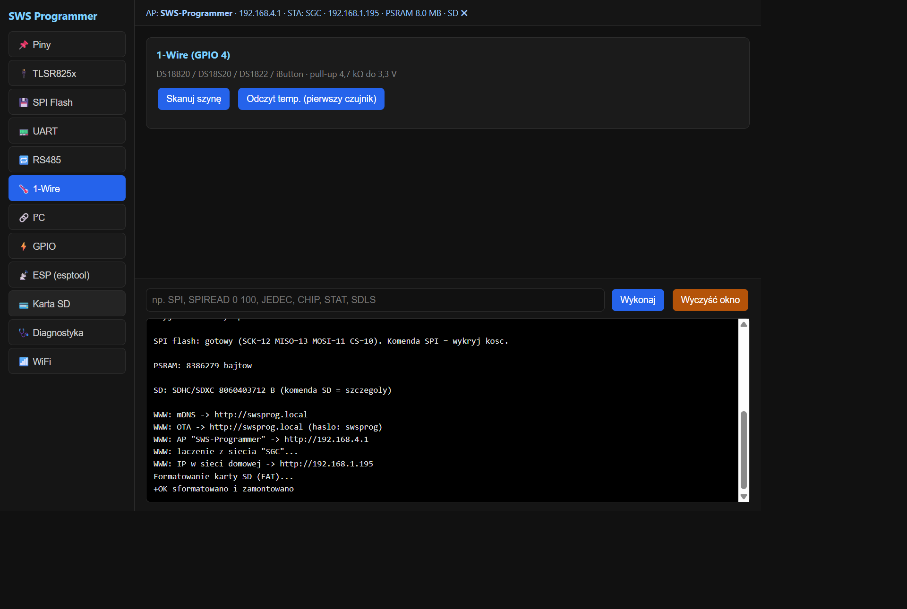 |

| I²C | GPIO | ESP (esptool) |
|-----|------|---------------|
| 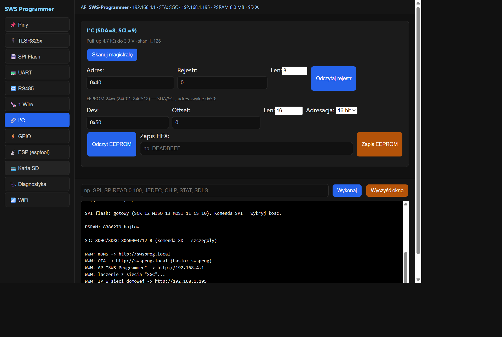 | 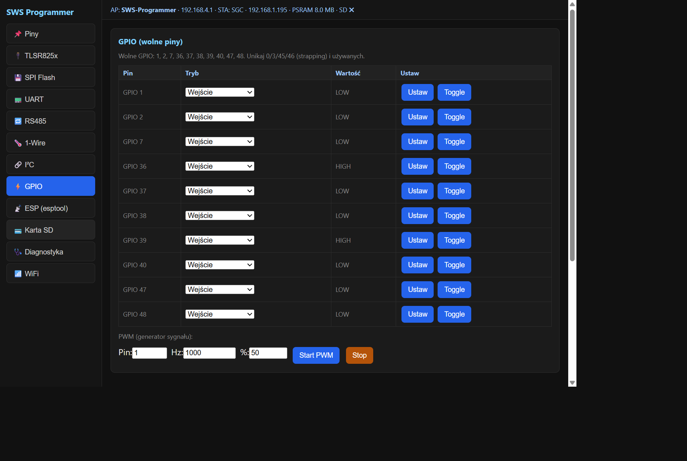 | 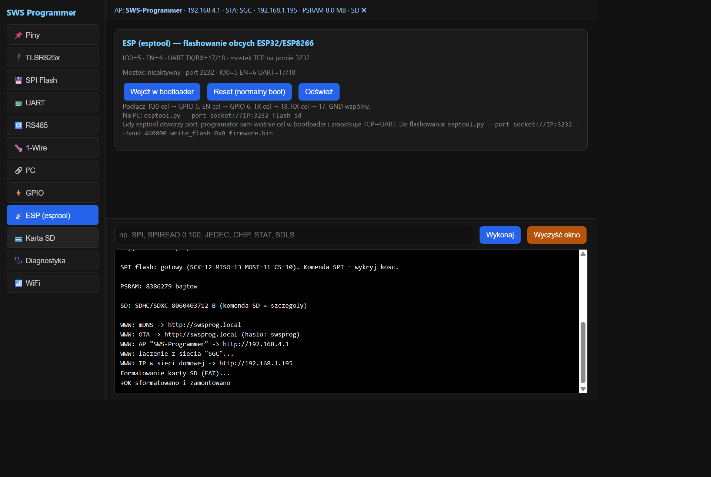 |

| Karta SD | Diagnostyka | WiFi |
|----------|-------------|------|
| 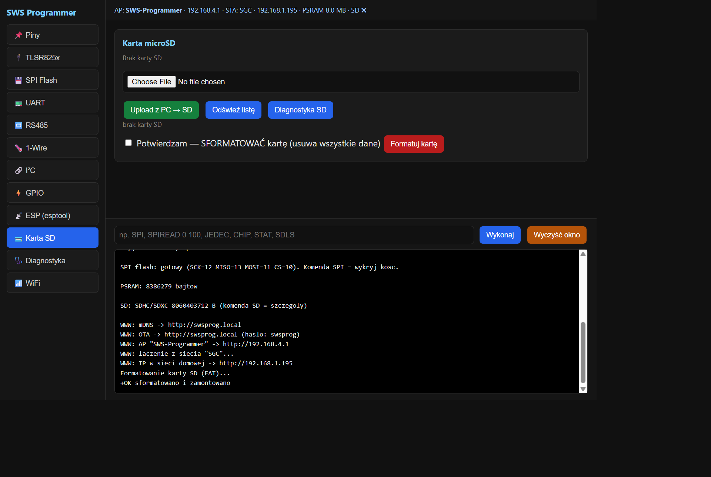 | 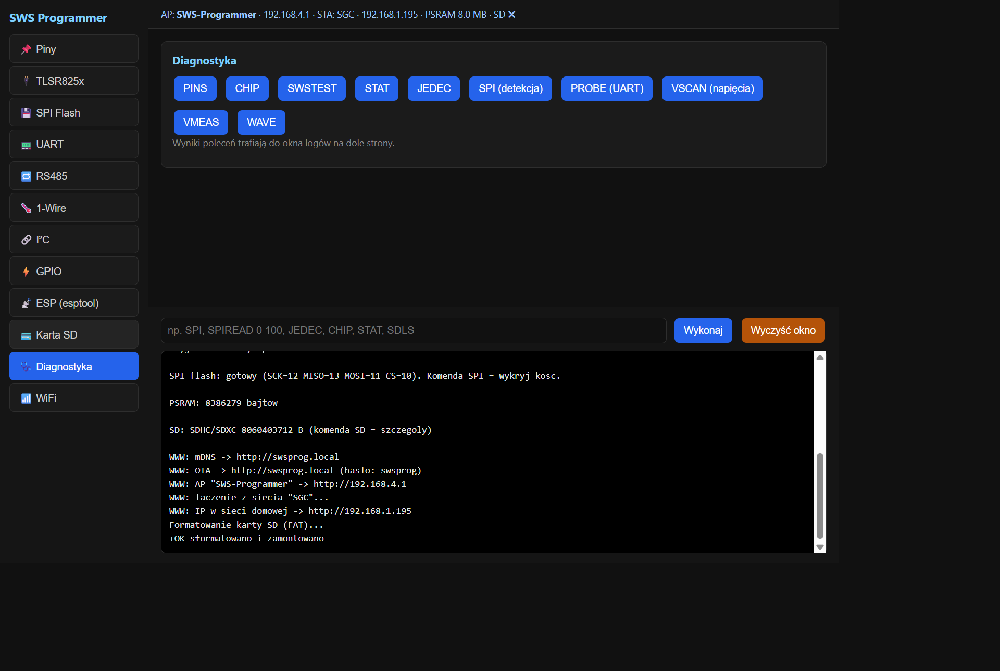 | 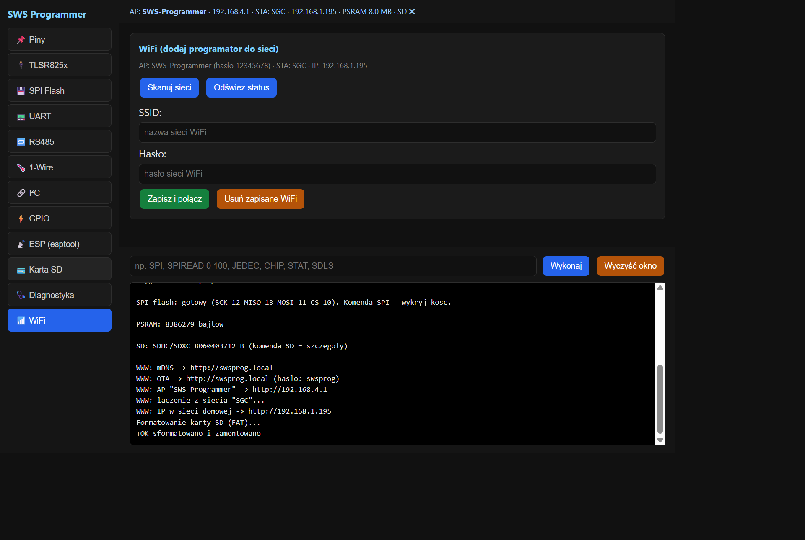 |

### License & attribution

Licensed under the **PolyForm Noncommercial License 1.0.0** — see [LICENSE](LICENSE).

The SWS technique and flashing loader are based on prior art from
[OpenEPaperLink](https://github.com/jjwbruijn/OpenEPaperLink) and
[pvvx/TlsrComProg](https://github.com/pvvx/TlsrComProg) — see the attributions
in `platformio.ini` and the source headers.

---

## Polski

### Funkcje

- **Programator SWS / Telink TLSR825x** — jednoprzewodowe programowanie
  (identyfikacja, odczyt, kasowanie, zapis, weryfikacja) pamięci flash układu
  docelowego przez rejestry MSPI celu. Do celu idą tylko 4 przewody:
  VCC, GND, SWS, RST.
- **Programator SPI NOR flash** — odczyt/zapis kości 25xx przez klips SOIC-8
  (2 MHz, bezpieczne przy dłuższych przewodach klipsa).
- **Karta microSD** — dostęp po SPI, przeglądanie + upload/download + **formatowanie**
  z poziomu interfejsu WWW.
- **UART celu** (115200 8N1) oraz **RS485** (półdupleks, MAX485/SN75176).
- **1-Wire** (DS18B20 itp.) i **I²C** (skan magistrali / odczyt rejestrów).
- **Panel GPIO** dla pozostałych wolnych pinów.
- **Mostek ESP** — programowanie innych ESP8266/ESP32/ESP32-C3 po sieci przez TCP
  (`esptool.py --port socket://<ip>:3232`) z automatycznym wejściem w bootloader.
- **Interfejs WWW** — SoftAP `SWS-Programmer` / hasło `12345678`, otwórz
  `http://192.168.4.1` w przeglądarce. Opcjonalny tryb STA (ustaw w `include/config.h`).

### Piny

| Funkcja         | Pin ESP32-S3 | Uwagi                                   |
|-----------------|--------------|-----------------------------------------|
| SWS (dane)      | GPIO42       | przez 470 Ω do SWS celu                 |
| RST (reset)     | GPIO41       | przez 470 Ω do RST celu                 |
| UART celu TX    | GPIO17       | ESP32 → RX układu                       |
| UART celu RX    | GPIO18       | ESP32 ← TX układu                       |
| RS485 TX / RX / DE | 33 / 34 / 35 | przez transceiver MAX485/SN75176       |
| SD SCK/MISO/MOSI/CS | 14/15/16/21 | HSPI, moduł Catalex microSD             |
| SPI flash SCK/MISO/MOSI/CS | 12/13/11/10 | FSPI, klips SOIC-8, 2 MHz     |
| I²C SDA / SCL   | 8 / 9        | pull-up 4,7 kΩ                          |
| 1-Wire          | GPIO4        | pull-up 4,7 kΩ do 3V3                   |
| Mostek ESP IO0 / EN | 5 / 6     | GPIO0 / EN układu docelowego            |
| Konsola         | GPIO43 / 44  | UART0, 115200 8N1 (CH343 → USB)         |

### Wgrywanie gotowego firmware

Gotowy obraz: `firmware/sws_programmer_esp32s3_n8r2_v1.1.bin`.

**Przez PlatformIO** (zalecane — wgrywa bootloader + tablicę partycji + aplikację):

```powershell
pio run -e esp32s3 -t upload --upload-port COMx
```

**Przez esptool** (sam obraz aplikacji, na płytkę z już wgraną partycją Arduino):

```powershell
esptool.py --chip esp32s3 --port COMx --baud 921600 write_flash -z 0x10000 firmware\sws_programmer_esp32s3_n8r2_v1.1.bin
```

### Budowanie ze źródeł

```powershell
pio run -e esp32s3
```

Firmware buduje się przy pomocy [PlatformIO](https://platformio.org/) i rdzenia
ESP32 Arduino (`platform = espressif32 @ ^6.7.0`).

### Szybki start z interfejsem WWW

1. Wgraj firmware i zasil płytkę.
2. Połącz się z siecią Wi-Fi **`SWS-Programmer`** (hasło `12345678`).
3. Otwórz `http://192.168.4.1` w przeglądarce.

Ten sam interfejs otworzysz przez **mDNS** pod `http://swsprog.local`, a po
dołączeniu do domowej sieci Wi-Fi (zakładka *WiFi*) — pod adresem DHCP płytki
(np. `http://192.168.1.195`). Aktualizacja OTA używa tego samego adresu mDNS
(`http://swsprog.local`, hasło `swsprog`).

#### Opis wszystkich zakładek

Interfejs to aplikacja jednostronicowa z 12 zakładkami i zawsze widoczną
konsolą (log + linia poleceń) na dole strony.

| # | Zakładka | Funkcja |
|---|----------|---------|
| 1 | 📌 **Piny** | Legenda pinów — każda funkcja (SWS, RST, UART, RS485, SPI flash, SD, 1-Wire, I²C, mostek ESP) z dokładnym numerem GPIO i uwagami. |
| 2 | 🔌 **TLSR825x** | Główne zadanie: jednoprzewodowe programowanie **SWS** układów Telink TLSR825x. Wykrywanie układu (`CHIP` / `CHIPID`), test łącza `SWSTEST`, status pamięci `STAT`, odczyt/zapis/zrzut rejestrów analogowych (kalibracja ADC), wgranie firmware, `Verify` oraz `Flash` (kasowanie + zapis + reset). |
| 3 | 💾 **SPI Flash** | Programator kości 25xx przez klips SOIC-8. Wykrywanie kości (JEDEC), blank check, odczyt do `.bin`, kasowanie sektorów / całej kości, weryfikacja i zapis. |
| 4 | 📟 **UART** | Terminal szeregowy (domyślnie 115200 8N1) na pinach UART celu: start/stop, auto-baud, logowanie RX→SD, wysyłanie tekstu lub HEX. |
| 5 | 🔁 **RS485** | Terminal półdupleksowy przez transceiver MAX485/SN75176: start/stop, wysyłanie tekstu lub HEX. |
| 6 | 🌡️ **1-Wire** | Skanowanie szyny i odczyt temperatury dla DS18B20 / DS18S20 / DS1822 / iButton. |
| 7 | 🔗 **I²C** | Skanowanie magistrali (1..126), odczyt rejestrów oraz odczyt/zapis EEPROM 24xx (24C01..24C512) z adresacją 8- lub 16-bitową. |
| 8 | ⚡ **GPIO** | Panel sterowania wolnymi pinami (wejście / pull-up / pull-down / wyjście, przełączanie) oraz generator PWM (pin, częstotliwość, wypełnienie). |
| 9 | 📡 **ESP (esptool)** | Programowanie obcych ESP8266 / ESP32 / ESP32-C3 po sieci: wejście w bootloader, reset oraz mostek TCP na porcie 3232 (`esptool.py --port socket://<ip>:3232`). |
| 10 | 💳 **Karta SD** | Przeglądarka microSD: lista plików, upload/download, usuwanie, **formatowanie**, diagnostyka SD. |
| 11 | 🩺 **Diagnostyka** | Diagnostyka jednym kliknięciem: `PINS`, `CHIP`, `SWSTEST`, `STAT`, `JEDEC`, `SPI`, `PROBE`, `VSCAN`, `VMEAS`, `WAVE` — wyniki trafiają do konsoli. |
| 12 | 📶 **WiFi** | Skanowanie sieci, dołączanie do domowego Wi-Fi (STA), usuwanie zapisanych danych, status AP/STA. |

Konsola na dole przyjmuje każde słowo kluczowe polecenia bezpośrednio
(np. `SPI`, `SPIREAD 0 100`, `JEDEC`, `CHIP`, `STAT`, `SDLS`) i pokazuje
cały wynik na żywo.

#### Zrzuty ekranu

| Piny | TLSR825x | SPI Flash |
|------|----------|-----------|
|  |  |  |

| UART | RS485 | 1-Wire |
|------|-------|--------|
|  |  |  |

| I²C | GPIO | ESP (esptool) |
|-----|------|---------------|
|  |  |  |

| Karta SD | Diagnostyka | WiFi |
|----------|-------------|------|
|  |  |  |

### Licencja i atrybucja

Licencja **PolyForm Noncommercial License 1.0.0** — zobacz [LICENSE](LICENSE).

Technika SWS i loader opierają się na wcześniejszych pracach
[OpenEPaperLink](https://github.com/jjwbruijn/OpenEPaperLink) oraz
[pvvx/TlsrComProg](https://github.com/pvvx/TlsrComProg) — atrybucje znajdują się
w `platformio.ini` i nagłówkach źródeł.